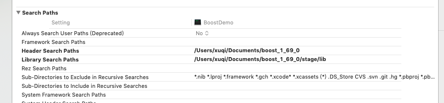

## BoostDemo
#### 下载编译使用

 [下载地址](https://dl.bintray.com/boostorg/release/1.69.0/source/)
 
```
./bootstrap.sh;./b2
```
第一条命令bootstrap.sh是编译前的配置工作,第二条命令b2开始

Makefile:

```
CFLAGS= -std=c++11 					#Linux应使用gnu++0x
INCLUDE=I/Users/chrono/boost/ 	#Boost库安装在用户主目录
STDLIB= -stdlib=libc++  			#Linux无需此FLAG
```

XCode配置：




#### Timer库

+ timer
+ progress_display

###### 处理日期

```
#define BOOST_DATE_TIME_SOURCE
#include <boost/date_time/gregorian/gregorian.hpp>
using namespace boost::gregorian;

```
+ date
+ date_period

###### 处理时间

```
#include <boost/date_time/posix_time/posix_time.hpp>
using namespace boost::posix_time;
```
+ hours
+ minutes
+ seconds
+ milliseconds
+ time_duration
+ ptime
+ time_period

#### 内存管理


